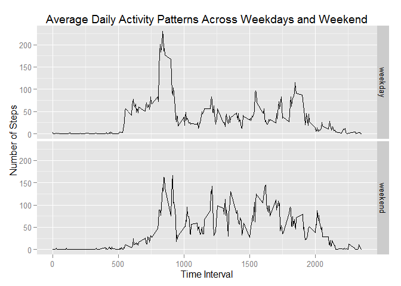

# Reproducible Research: Peer Assessment 1


## Loading and preprocessing the data
First and foremost, check to see if data already exists. If not, a URL is provided for the `activity.zip` file to be downloaded from the Internet, and the `activity.csv` file will then be unzipped. The .csv file is then stored into a variable `act`.

```r
##  check if file exists; if not, download the file again
if(!file.exists("activity.csv")){
    if(!file.exists("activity.zip")) {
        message("Downloading data")
        fileURL <- "https://d396qusza40orc.cloudfront.net/repdata%2Fdata%2Factivity.zip"
        download.file(fileURL, destfile = "./activity.zip", method = "curl")
    }
    unzip("activity.zip")
}

##  read data into variable act
act <- read.csv('activity.csv')
```

Next, transform the `date` variable to the Date class for later user.

```r
##  transform date to Date class instead of factor
act <- transform(act, date = as.Date(act$date, format = "%Y-%m-%d"))
```


## What is mean total number of steps taken per day?
1.  Calculate the total number of steps taken per day (make a histogram).

```r
##  load ggplot2 package
library(ggplot2)

##  calculate the total number of steps taken each day
stepsDay <- with(act,
                 tapply(steps, date, sum, na.rm = TRUE))

##  create histogram of total number of steps taken per day
qplot(stepsDay,
      binwidth = max(stepsDay/10),
      xlab = "Total Steps per Day",
      ylab = "Frequency",
      main = "Total Number of Steps Taken Each Day")
```

 

2.  Calculate and report the mean and median of the total number of steps taken per day

```r
##  extract mean and median values from summary function
mean_stepsDay <- summary(stepsDay)[["Mean"]]
median_stepsDay <- summary(stepsDay)[["Median"]]
```
The **mean** of the total number of steps taken per day is **9354**.  
The **median** of the total number of steps taken per day is **10400**.

## What is the average daily activity pattern?
1.  Make a time series plot (i.e. type = "l") of the 5-minute interval (x-axis) and the average number of steps taken, averaged across all days (y-axis)

```r
##  create new data frame comparing average number of steps taken for each 5-minute interval
avgSteps <- with(act,
                 aggregate(list(steps = steps),
                           list(interval = interval),
                           mean, na.rm = TRUE))

##  create a time series plot of Interval vs Average Steps
ggplot(avgSteps, aes(interval,steps)) +
    geom_line() + 
    labs(x = "Time Interval",
         y = "Number of Steps",
         title = "Average Daily Activity Pattern")
```

 

2.  Which 5-minute interval, on average across all the days in the dataset, contains the maximum number of steps?

```r
##  extract interval number of subsetted maximum data
max_avgSteps <- subset(avgSteps, steps == max(steps))[['interval']]
```
The 5-minute interval with the maximum number of average steps taken across all days in dataset is **835**.

## Imputing missing values
1.  Calculate and report the total number of missing values in the dataset (i.e. the total number of rows with `NA`s)

```r
totalMissing <- sum(is.na(act$steps))
```
The total number of missing values if the dataset is **2304**.

2.  Devise a strategy for filling in all of the missing values in the dataset. The strategy does not need to be sophisticated. For example, you could use the mean/median for that day, or the mean for that 5-minute interval, etc. Create a new dataset that is equal to the original dataset but with the missing data filled in.
We will replace the missing data with the mean of that 5-minute interval, previously calculated into the data `avgSteps`.

```r
##  store act into new variable
newAct <- act

##  find indices of the missing values in original dataset
missing <- which(is.na(act$steps))

##  replace the missing values with the mean of that interval
newAct$steps[missing] = rep(avgSteps$steps, length(unique(newAct$date)))[missing]
```

3.  Make a histogram of the total number of steps taken each day and calculate and report the **mean** and **median** total number of steps taken per day. Do these values differ from the estimates from the first part of the assignment? What is the impact of imputing missing data on the estimates of the total daily number of steps?

```r
##  calculate the total number of steps taken each day
newStepsDay <- with(newAct,
                 tapply(steps, date, sum))

##  create histogram of total number of steps taken per day
qplot(newStepsDay,
      binwidth = max(stepsDay/10),
      xlab = "Total Steps per Day",
      ylab = "Frequency",
      main = "New Total Number of Steps Taken Each Day")
```

 


```r
##  extract mean and median values from summary function
new_mean_stepsDay <- summary(newStepsDay)[["Mean"]]
new_median_stepsDay <- summary(newStepsDay)[["Median"]]
```
The **new mean** of the total number of steps taken per day is **10770**, as opposed to the previous value of **9354**.   
The **new median** of the total number of steps taken per day is **10770**. as opposed to the previous value of **10400**.

Imputing the missing values resulted in the estimates of the total number of steps to be larger than than previously calculated. This is a reasonable result, since previously the missing datapoints were disregarded completely. Adding these results back in will increase the mean and median regardless of magnitude.

## Are there differences in activity patterns between weekdays and weekends?
Using the dataset with the filled-in missing values `newAct`,

1.  Create a new factor variable in the dataset with two levels – “weekday” and “weekend” indicating whether a given date is a weekday or weekend day.

```r
##  define vector for weekdays
weekday <- c("Monday", "Tuesday", "Wednesday", "Thursday", "Friday")

##  create new variable dayType in newAct; if a day is contained in wkdy vector
##  its dayType will be "weekday", otherwise it will be "weekend"
newAct$dayType = ifelse(weekdays(newAct$date) %in% weekday, "weekday", "weekend")
```

2.  Make a panel plot containing a time series plot (i.e. type = "l") of the 5-minute interval (x-axis) and the average number of steps taken, averaged across all weekday days or weekend days (y-axis). See the README file in the GitHub repository to see an example of what this plot should look like using simulated data.

```r
##  create new data frame comparing average number of steps taken for each 5-minute interval from filled-in data
new_avgSteps <- with(newAct,
                 aggregate(list(steps = steps),
                           list(interval = interval,
                                Day.Type = dayType),
                           mean, scientific = FALSE))

##  create a time series plot of Interval vs Average Steps
ggplot(new_avgSteps, aes(interval,steps)) +
    facet_grid(Day.Type ~ .) + 
    geom_line() + 
    labs(x = "Time Interval",
         y = "Number of Steps",
         title = "Average Daily Activity Patterns Across Weekdays and Weekend")
```

 
